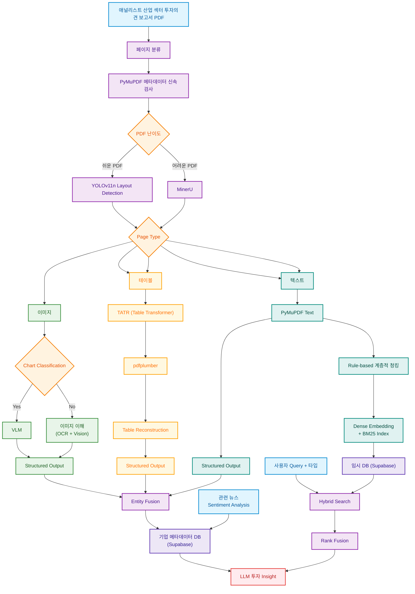

안녕하세요 2조입니다.

## 파이프라인 개요

애널리스트 산업 섹터 투자의견 보고서(PDF)를 입력받아, 페이지 단위로 분류 → 텍스트/테이블/이미지
세 갈래로 병렬 처리 → 근거를 통합해 인덱싱 → 질의에 대해 근거 기반 투자 인사이트를 생성하는
멀티모달 RAG 파이프라인입니다.



> 이 다이어그램은 팀이 설계한 아키텍처 원본이며(원본 이미지: [`pdf_pipeline/reference/ERD.png`](pdf_pipeline/reference/ERD.png)),
> 아래 "단계별 핵심 내용"에서 각 노드가 현재 실제로 어디까지 구현됐는지 구분해뒀습니다.

## 단계별 핵심 내용

- **페이지 분류 (`pdf_pipeline/page_classification/`)**: PyMuPDF로 메타데이터를 먼저 신속검사해
  쉬운/어려운 PDF를 나누고, 쉬운 페이지는 YOLOv11n으로, 어려운 페이지는 MinerU로 레이아웃을
  검출해 텍스트/표/이미지 영역을 결정. 같은 YOLO 추론 결과를 텍스트/테이블 단계까지
  캐싱·재사용해 페이지당 중복 추론을 없앰(`yolo_layout.py`).
- **난이도 라우팅 (`pdf_pipeline/text_processing/reading_order_router.py`)**: 다단 컬럼이 기하학적으로
  겹친다고 무조건 리딩오더 복원이 필요한 건 아니라는 점(원문 추출 순서가 컬럼별로 그룹화돼
  있으면 문제없음)을 반영해, `material_overlaps AND interleaving_excess≥2`를 동시에 만족할 때만
  "hard"로 판정. Claude가 실제 문서를 전수 검토한 결과를 기준으로 캘리브레이션.
- **스캔본 처리 (`pdf_pipeline/scanned_page_router.py`)**: 텍스트 레이어가 사실상 없는 페이지를
  감지해 MinerU 파싱 결과로 통째 대체(리딩오더 문제와는 독립적인 별개 판정).
- **텍스트 브랜치 (`pdf_pipeline/text_processing/`)**: PyMuPDF로 텍스트 추출 후 규칙 기반 계층적
  청킹과 구조화 출력(OpenAI structured output, 문서 섹터별 필드 힌트)을 페이지 단위로 병렬 실행.
  스트리밍 처리(`process_pdf_streaming`)로 페이지 완료 즉시 다음 단계로 넘길 수 있음.
- **테이블 브랜치 (`pdf_pipeline/table_processing/`)**: TATR(Table Transformer)로 셀 구조를
  인식하고 pdfplumber로 원문을 재구성한 뒤, 섹터별 canonical field 스키마에 맞춰 구조화 출력.
- **이미지 브랜치 (`pdf_pipeline/image_processing/`, 구현 완료)**: MinerU 레이아웃탐지 →
  규칙 필터(크기/종횡비로 명백한 junk 제거) → MinerU 내장 OCR(PP-OCRv6/v5, 한국어)로 크롭
  텍스트 추출 → DocumentFigureClassifier-v2.5(26종 세부라벨)로 상호검증 → useful 판정된
  차트만 MinerU2.5-Pro VLM으로 데이터 표 근사 추출 후 로컬 LLM(qwen3:8b)으로 서술형 해석까지
  변환. 전량 CPU 실행 가능하도록 설계(자세한 내용은 `pdf_pipeline/image_processing/README.md`).
- **엔티티 합성 (`pdf_pipeline/entity_fusion.py`)**: 세 브랜치의 출력을 하나의 evidence로 모으고
  소스 타입별 신뢰도 가중치(표 > 이미지 > 텍스트)를 매겨 검색 점수에 반영.
- **인덱싱 (`pdf_pipeline/text_processing/index_text.py`)**: BM25 + BGE-m3-ko 하이브리드 검색
  스켈레톤(dense 우선, BM25 보조). Supabase 스키마 확정 전이라 현재는 인메모리 구현이며, 인터페이스만
  고정해 나중에 Supabase(pgvector)로 교체 가능하도록 설계.
- **검색**: 사용자 질의를 하이브리드 검색(BM25+BGE-m3-ko) 후 Rank Fusion으로 결합. 다이어그램의
  "관련 뉴스 Sentiment Analysis"는 현재 뉴스 헤드라인 수집(`data_collection/fetch_news.py`)까지만
  구현됐고, 감성분석 후 기업 메타데이터 DB에 결합하는 부분과 "Query 타입"별 라우팅은 아직
  설계 단계입니다.
- **생성 (`pdf_pipeline/citation_check.py`)**: LLM 답변에 등장하는 숫자가 실제 컨텍스트 근거에
  있는지 검증하고, 없으면 피드백과 함께 재생성.
- **엔드투엔드 데모**: `pdf_pipeline/run_investment_opinion_demo.py`가 PDF 한 건으로 위 전체 흐름을
  한 번에 실행(스캔본 감지 → 3-브랜치 병렬 → 엔티티 합성 → 하이브리드 검색 → citation-check 포함
  답변 생성).

배포(서빙/API화)는 아직 구현하지 않았고, 위 파이프라인 단계만 로컬에서 검증된 상태입니다.

## Setup

모델 가중치(`models/`)는 용량이 커서(30GB+) git에 올리지 않습니다. 각자 아래로 받으세요.

```bash
pip install -r requirements.txt
python scripts/download_models.py        # 전체 다운로드
python scripts/download_models.py qwen   # Qwen2.5-VL-7B-Instruct만
python scripts/download_models.py llava  # LLaVA-OneVision-7B-OV만
```

자세한 설계 배경과 실험 기록은 [docs/PRD_pdf_pipeline.md](docs/PRD_pdf_pipeline.md) 및 각 단계
디렉토리의 `실험.md`(`pdf_pipeline/text_processing/실험.md`, `table_processing/실험.md` 등) 참고.

이미지 크롭을 분류·정형화·저장하는 **이미지 파이프라인 고도화판**(VLM 캐시, pHash 중복제거,
그림 분류기 게이트, ChartQA A/B 등)은 [pipeline/README.md](pipeline/README.md) 참고.
