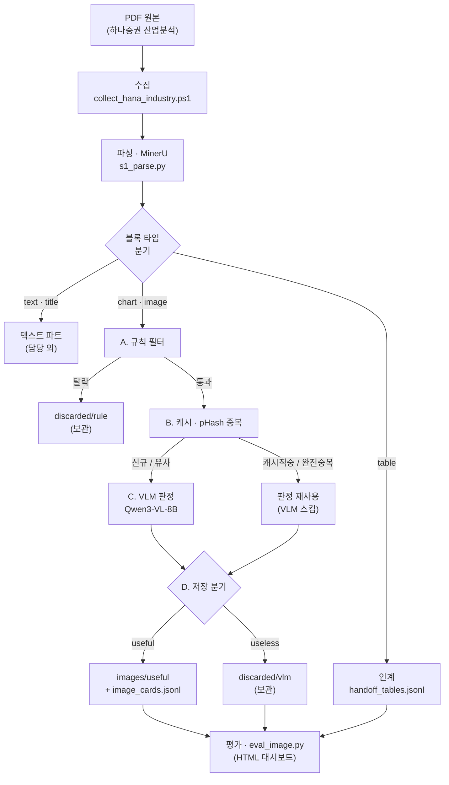

# 리서치 PDF 이미지 파이프라인 — 프레임워크

PDF 1개가 들어와 **검색 가능한 이미지 카드**로 나오기까지의 전체 구조.

---

## 1. 아키텍처



> 이 파이프라인의 담당은 **chart · image** 뿐. table은 판정 없이 인계, text·title은 다른 파트.

---

## 2. 스테이지 요약

| 단계 | 스크립트 | 입력 | 처리 | 출력 |
|---|---|---|---|---|
| **0 수집** | `collect_hana_industry.ps1` | 네이버 금융 목록 | 산업분석 中 하나증권만 필터·다운로드 | `data/raw/*.pdf` + `metadata.csv` |
| **1 파싱** | `s1_parse.py` (MinerU) | PDF | 페이지별 블록 탐지 + 크롭 | `data/parsed/{doc_id}/` (middle·content_list·images) |
| **2 이미지** | `s2_image_pipeline.py` ★ | chart·image 크롭 | 4단계 게이트(A→B→C→D) | `image_cards.jsonl` + useful/discarded |
| **2′ 인계** | (동상) | table 크롭 | VLM 없이 목록 기록 | `handoff/handoff_tables.jsonl` |
| **3 평가** | `eval_image.py` | image_cards + 로그 | 고도화 지표 산출 | `eval/eval_report.html` |
| **검수** | `review_viewer.py` | review_queue + 표본 | 라벨링 → 정확도 산정 | `eval/image_labels.csv` |

---

## 3. 이미지 4단계 게이트 (2단계 상세)

크롭마다 결정적 ID 부여: `image_id = {doc_id}_p{page}_{block_type}{n}`

| 게이트 | 하는 일 | 통과 규칙 / 핵심 파라미터 | 실패·특수 처리 |
|---|---|---|---|
| **A. 규칙 필터** | 크기·모양으로 즉시 선별 | `chart`=크기무관 통과 · `image`=<100px, 종횡비>8:1, 면적<15,000px² 탈락 | 탈락→`discarded/rule/` 보관 |
| **B. 캐시·중복** | VLM 호출을 아끼는 곳 | 캐시키=`content_hash+prompt_ver+model` · pHash 해밍 0=복사, 1~6=유사표시 | 적중→VLM 스킵(`dedup_of`) |
| **C. VLM 판정** | Qwen3-VL로 유형·유용성 판단 | JSON 강제(type·useful·confidence·ocr·summary·entities) · temp 0.1 | conf<0.6→`review_queue` · 파싱실패 1회 재시도 |
| **D. 저장** | 결과에 따라 배정 | useful→`useful/`+embed_text · useless→`discarded/vlm/` | table_image 재분류→인계 이중등록 |

**판정 철학**: 로고를 유용으로 넣는 오류(FP) > 차트를 놓치는 오류(FN) → 애매하면 useful=false.

---

## 4. 데이터 산출물 맵

```
data/
├── raw/industry/*.pdf + metadata.csv     [0] 원본 20건
├── parsed/{doc_id}/                       [1] middle.json · content_list.json · images/*.jpg
├── images/
│   ├── useful/{doc_id}/*.jpg              [2D] 유용 판정
│   ├── discarded/{rule,vlm}/              [2A,2D] 탈락분 (삭제 안 함)
│   └── image_cards.jsonl                  [2] 이미지 1장 = 1레코드 (전 건)
├── cache/vlm/                             [2B] VLM 판정 캐시 (L1)
└── handoff/handoff_tables.jsonl           [2′] 표 인계 목록
eval/
├── eval_report.html                       [3] 지표 대시보드
├── review.html / image_labels.csv         [검수] 라벨링
```

**image_cards.jsonl 1줄 =**
`image_id · doc_id · page · block_type · bbox · caption · content_hash · phash · dedup_of · vlm_type · vlm_useful · confidence · ocr_text · summary · entities · embed_text · review_queue · prompt_ver · filter_stage · file`

---

## 5. 기본형 → 고도화 (델타)

| 항목 | 기본형 | 고도화 | 측정 지표 |
|---|---|---|---|
| 반복 판정 | 매번 VLM 재호출 | content_hash 캐시 | **재실행 시 VLM 0회** (절감률) |
| 중복 이미지 | 각각 판정 | pHash 중복제거 | 완전중복 복사 수 |
| 저신뢰 결과 | 구분 없음 | confidence<0.6 자동 선별 | review_queue 비율 |
| 표(table) | VLM에 태움 | VLM 제외·인계만 | 표 VLM 0건(무결성) |
| 프롬프트 | 수동 재실행 | prompt_ver 버전관리 | 회귀 비교 |
| 상태 파악 | 로그 | eval 대시보드 | 한 장 요약 |

---

## 6. 운영 원칙

- **결정적 ID** — 같은 입력 = 같은 image_id (재실행 안전)
- **resume** — 완료분 스킵, 어디서 죽어도 이어서
- **격리 실패** — 개별 건 실패는 기록 후 계속, **Ollama 5연속 실패 시에만 중단**
- **캐시 키 = 내용해시 + 버전** (파일명·시간 금지), `prompt_ver` 올리면 전량 재판정
- **discard 보관** — 삭제 금지 (복구·튜닝 근거)
- **저장** — 로컬 JSONL이 원본, `.env`에 Supabase 키 있으면 DB upsert(선택)

---

## 7. 실측 스냅샷 (2건 검증분)

| | 최초 실행 | 재실행(`--force`) |
|---|---|---|
| VLM 호출 | 24회 (~27s/장) | **0회** |
| 캐시 적중 | 0 | **24 (100%)** |
| 소요 | ~10분 | **<1초** |

table 인계 무결성 ✓ (표 18건 VLM 0건) · 판정 24건 useful (line 16/bar 6/pie 2) · 평균 confidence 0.95
