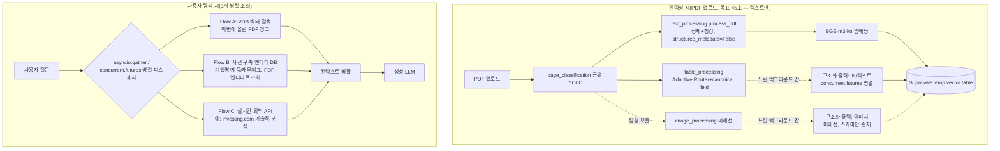

# [31] 생성(Generation) 단계 아키텍처 설계 — 병렬화 / <5초 타당성 / 3-플로우 구조 / 생성 LLM 선정 A/B

사용자 요청 5개를 한 번에 다룸: (1) 구조화 출력 병렬화, (2) PDF 업로드 시 텍스트를 5초 내외로
청킹+임베딩해 임시 벡터DB(Supabase)에 넣는 게 가능한지, (3) PDF 유래 벡터DB / 사전 구축된
엔티티 DB(기업명·제품·재무제표) / 실시간 외부 API(기술적 분석) 3개를 병렬로 처리하는 구조,
(4) 표/이미지 구조화 출력은 텍스트보다 천천히 붙여도 되는 제약, (5) 생성 LLM 후보(Qwen vs GPT)
비교 A/B 방법론.

---

## 1. 구조화 출력 병렬화 — 완료, 재검증됨

`concurrent.futures.ThreadPoolExecutor`(I/O 바운드 API 호출이라 스레드로 충분, `max_workers=8`
기본값)로 텍스트(`process_pdf`)와 표(`build_records`) 양쪽 다 배선 완료. 로컬 연산(YOLO/청킹/표
파싱)을 전부 끝낸 뒤 구조화 출력 API 호출만 마지막에 한꺼번에 병렬 디스패치하는 구조로 변경.

**재측정 결과(LGCNS/Construct, 병렬화 전후)**:

| | 텍스트(off→on) | 표(off→on) |
|---|---|---|
| 병렬화 전 | LGCNS +23.79s, Construct +21.74s | LGCNS +25.42s(표당 1.96s), Construct +28.37s(표당 1.89s) |
| **병렬화 후** | LGCNS **+14.59s**, Construct **+9.02s** | LGCNS **+3.95s**(표당 **0.30s**), Construct **+3.58s**(표당 **0.24s**) |

표 쪽은 **6~8배 단축**(호출 수가 많고 서로 완전 독립적이라 병렬 이득이 큼). 텍스트는 페이지당
1회 호출이라 문서가 작을수록(청크 있는 페이지 3~5개) 동시성 이득의 상한이 낮음 — K-Wave처럼
청크 있는 페이지가 많은 대형 문서일수록 병렬화 이득이 더 커질 것으로 예상(실측은 비용상 생략,
필요시 재검증 가능).

---

## 2. "PDF 업로드 → 5초 내외로 청킹+임베딩+임시 벡터DB 적재" 타당성 검토

실측(구조화 출력 OFF 상태, 순수 추출+청킹+임베딩 기준):

| PDF | 페이지 | 추출+청킹 | 임베딩(청크 전량, BGE-m3-ko) | 합계 | 5초 이내? |
|---|---|---|---|---|---|
| LGCNS | 6 | 0.99~1.01s | ~0.13~0.3s(17개 청크) | **~1.2~1.3s** | ✅ 여유 있음 |
| Construct | 10 | 1.13~1.15s | ~0.15s(20개 청크) | **~1.3s** | ✅ 여유 있음 |
| K-Wave | 73 | **11.0s** | ~0.9s(135개 청크) | **~11.9s** | ❌ 이미 초과 |

**결론: 문서 크기에 따라 다르다.** 6~10페이지짜리 개별 기업/산업 Weekly 리포트라면 Supabase
insert(측정은 안 했지만 배치 insert 1회면 통상 100~300ms 수준)를 더해도 5초 안에 여유 있게
들어온다. 하지만 K-Wave 같은 73페이지 산업 리포트는 **추출+청킹 단계 자체가 이미 11초**라 5초
목표를 못 맞춘다 — 병목은 임베딩이 아니라 **페이지당 순차 YOLO+계층청킹 루프**(73페이지를 한
장씩 순서대로 처리).

**후속 조치(다음 대화 턴에서 실제로 진행함, `text_processing/실험.md [32]` 참고)**:
1. **원인 프로파일링**: cProfile로 뜯어보니 11.0초 중 3.99초는 임베딩 모델 1회성 콜드 로드(서버
   프로세스라면 무시 가능), boilerplate 시드 문장을 페이지마다 재인코딩하는 실제 버그가 하나
   있어(`_get_seed_embeddings()` 캐싱으로 수정) 6.61s → **5.02~5.37s**로 줄임.
2. **threading은 실측으로 기각**: `get_textbox()`(전체의 45%) 병렬화를 `ThreadPoolExecutor`로
   시도했으나 속도 개선 1.01배(사실상 0) — PyMuPDF C 확장이 GIL을 안 놓는다는 뜻 확인. 진짜
   병렬화하려면 멀티프로세싱이 필요한데(워커마다 YOLO 재로딩 비용 대비 남은 이득이 제한적이라)
   **구현 안 함**.
3. **목표 재정의로 실질 해결 — `process_pdf_streaming()` 구현·검증 완료**: "문서 전체가 5초 안에
   끝나야 한다" 대신 "페이지가 끝나는 대로 즉시 검색 가능해야 한다"로 목표를 바꾸고, 페이지 단위
   제너레이터를 새로 추가(`text_extraction.process_pdf_streaming()`). K-Wave 73페이지 기준
   **첫 페이지까지 302ms** — 배치 버전과 결과 완전 일치 검증(불일치 0건). 대형 문서의 체감
   지연 문제는 사실상 이걸로 해결됐다고 판단.

**구조화 출력은 이 5초 경로에서 원천 제외**(사용자 지시 "표/이미지 메타데이터는 텍스트보다
천천히 붙여도 됨"과 일치) — `add_structured_metadata=False`가 기본값이라 이미 그렇게 동작함.
구조화 출력(텍스트/표/이미지 전부)은 **별도의 느린 큐/백그라운드 잡**으로 돌리고, 완료되는 대로
같은 레코드에 UPDATE로 붙이는 방식을 권장(아래 3번 아키텍처에 반영).

---

## 3. Supabase 프로젝트 확인 — 불일치 발견(사용자 확인 필요)

MCP로 연결된 Supabase 계정에서 프로젝트 2개 확인:
- `CertWeb`(ACTIVE_HEALTHY, region ap-northeast-2) — 이름상 이 프로젝트와 무관해 보임
- `FINANCE`(**INACTIVE**, region ap-northeast-2) — 이름은 이 프로젝트와 맞아 보이나 비활성 상태

그런데 `.env`의 `SUPABASE_DATA_URL=https://itkxhdutnxircvbzwpon.supabase.co`는 이 두 프로젝트
중 **어느 쪽 ref ID와도 일치하지 않음**(`xldoiqbvdxcykdlyeoiu`, `abmywcdqebpufyuwqlju`). 즉
`.env`가 가리키는 프로젝트가 지금 MCP로 연결된 계정에는 안 보이는 제3의 프로젝트이거나, 조직이
다르거나, 예전에 쓰던 프로젝트가 바뀐 것일 수 있음 — **실제 인덱싱에 쓸 프로젝트가 어느 쪽인지
확인 필요**. 이 불일치 때문에 이번엔 실제 테이블 생성/insert 테스트는 하지 않고 설계만 진행함
(잘못된 프로젝트에 테스트 데이터를 넣는 걸 피하기 위해 — 특히 `FINANCE`가 INACTIVE 상태인 것도
확인이 필요한 부분: 의도적으로 멈춰둔 건지, 무료 티어 휴면인지).

---

## 4. 3-플로우 병렬 아키텍처

사용자가 설명한 3가지 정보원 + 표/이미지 구조화 출력(별도 느린 레인)을 아래처럼 구성 제안:

**핵심 설계 포인트**:
- **인덱싱 시점**(문서 업로드)의 "5초 목표"는 텍스트 경로(Flow A 준비)에만 적용 — 표/이미지
  구조화 출력은 완전히 분리된 느린 레인으로 돌아가고, 완료되는 대로 같은 `pdf_id`/`page`/
  `table_idx` 키로 VDB 레코드에 UPDATE(사용자 지시와 일치).
- **쿼리 시점**의 3-플로우 병렬화는 Python `asyncio.gather`(각 flow가 네트워크 I/O면 이게 자연스러움)
  또는 `concurrent.futures.ThreadPoolExecutor`(동기 클라이언트 라이브러리만 있는 경우) 중 택1 —
  Supabase Python 클라이언트가 동기식이면 후자, `httpx.AsyncClient` 기반으로 직접 구현하면 전자.
  셋 다 I/O 바운드라 병렬화 이득이 큼(구조화 출력 병렬화에서 이미 실측 확인한 것과 같은 원리).
- **Flow B(엔티티 DB)**는 이 PDF에서 추출된 엔티티(구조화 출력의 `entities`/`entities_mentioned`
  필드, 또는 `sector_classifier`가 이미 판별한 섹터)로 기존 DB를 조회하는 방식 — "나중에 더
  추가될 예정"이라 하셨으니 스키마를 지금 확정하기보다 조회 인터페이스(예: `get_company_financials(
  ticker_or_name) -> dict`)만 얇게 정의해두고, 실제 DB 스키마는 그쪽 작업 진행 상황에 맞춰 나중에
  맞추는 게 안전(오버엔지니어링 방지).
- **Flow C(실시간 API)**는 "나중에 고도화 파트"라고 명시하셨으니 이번엔 인터페이스만 스텁으로
  잡아두는 걸 권장 — `fetch_technical_analysis(ticker) -> str`(예시로 주신 markdown 그대로 반환).
  실시간 크롤링/API 호출의 실제 소스(investing.com 등)는 약관/robots.txt 확인이 필요한 영역이라
  이번 설계 문서에는 인터페이스만 명시하고 실제 구현은 보류.

**아직 구현하지 않은 것(설계만)**: Supabase 스키마 자체(프로젝트 불일치로 보류), Flow B/C의
실제 조회 로직, asyncio 기반 쿼리 오케스트레이터 코드. 이유: 셋 다 이 세션 하나로 확정 짓기엔
사용자 확인이 필요한 인프라 결정(어느 Supabase 프로젝트인지, 엔티티 DB 스키마, 외부 API 소스의
약관)이 얽혀 있어 — 구조는 위 다이어그램대로 잡아뒀으니, 확인되는 대로 바로 코드로 옮기면 됨.

---

## 5. 생성 LLM 선정 — Qwen vs GPT A/B 테스트 설계

### 후보

| 후보 | 근거 |
|---|---|
| **GPT-4o-mini** | 이미 구조화 출력에 채택([11]/[25]), 같은 계정/키 재사용, Structured Output 지원 |
| **GPT-5-mini**(또는 그 시점 최신 저비용 GPT) | "저비용 고성능" 조건에 맞는 최신 세대 후보 |
| **Qwen2.5-VL-7B**(로컬, 이미 보유) | API 비용 0(전기세만), 완전 오프라인, 단 로컬 GPU/MPS 자원 점유 |
| **Qwen3(API, 알리바바 클라우드 또는 오픈라우터 경유)** | Qwen 최신 세대, 로컬 7B보다 크고 정확할 가능성 |

일반 시장 벤치마크(Qwen2.5 계열 vs GPT-4o-mini) 기준: Qwen이 비용은 대체로 더 싸고(예: Qwen2.5:14B가
동일 워크로드에서 GPT-4o-mini 대비 약 2.3배 저렴이라는 보고 있음) 일부 벤치마크에서 정확도도
근소 우위지만, **한국어 금융 리포트 생성**에 특화된 비교 데이터는 존재하지 않음(검색으로 확인) —
이 프로젝트 도메인(한국 증권 리포트 요약/QA)에 대해서는 **직접 golden set A/B가 필수**라는 뜻.
이건 이 세션에서 이미 여러 번 쓴 방법론(임베딩 3종 비교, 섹터 분류 2종 비교와 동일 패턴)과 일치.

### 평가 축(RAGAS 스타일 + 도메인 특화)

일반 RAG 생성 평가는 보통 3계층으로 나눈다(검색 결과 기준):
1. **검색(retrieval)**: precision/recall/MRR@k — 이건 이미 우리가 임베딩/canonical field
   단계에서 별도로 재고 있음([9], [21]~[28]), 생성 LLM 비교와는 분리해서 유지.
2. **생성(generation)**: **faithfulness**(답변의 각 주장이 실제로 검색된 컨텍스트에 근거하는가,
   claim 단위로 쪼개 채점), **context utilization**(준 컨텍스트를 실제로 활용했는가).
3. **엔드투엔드**: **answer correctness**(정답과 비교해 맞았는가), **helpfulness**.

이 프로젝트는 재무 수치가 핵심이라 **숫자 정확성**이 특히 중요 — faithfulness/correctness를
"LLM 판사(judge model)"로만 채점하면 애매한 수치 오류를 놓칠 수 있어서, **숫자가 들어간 질문은
정규식/정확 매칭으로 별도 채점**(이 세션에서 이미 쓴 "anchor 문자열 포함 여부" 패턴 재사용
가능)하고, 서술형 질문만 LLM 판사에게 맡기는 이원화를 제안.

### 테스트 설계(구체안)

1. **Golden set 구성**: 이 프로젝트의 실제 문서(LGCNS/Construct/K-Wave)에서 뽑은 질문 20~30개 —
   (a) 숫자형(예: "LG CNS의 2Q26 예상 매출액은?") (b) 서술형(예: "이 리포트가 하이브를 최선호주로
   꼽은 이유는?") (c) 다중 소스 종합형(예: "이 기업의 최근 실적과 최선호 이유를 종합해서 요약해줘"
   — Flow A+B+C를 다 써야 답할 수 있는 질문) 세 유형을 섞음. 정답은 기존 패턴대로 직접 원문
   대조로 작성(Claude가 골든셋 작성, 이미 여러 번 쓴 방식).
2. **각 후보 모델에 동일 컨텍스트(같은 검색 결과) 주고 답변 생성** — 검색 품질 차이가 아니라
   **생성 품질 차이만** 보기 위해 컨텍스트는 고정.
3. **채점**: 숫자형은 정확 매칭/허용오차, 서술형은 judge model(예: GPT-4o나 Claude, 후보 모델
   자신은 판사로 안 씀 — 자기 평가 편향 방지)로 faithfulness 0~1 스코어링.
4. **비용/지연 동시 기록**: 질문당 토큰 사용량·응답시간·API 비용을 로그로 남겨 정확도 표와
   나란히 제시.
5. **판정 기준**: 사용자 지시대로 **정확도가 지연보다 우선** — 정확도 차이가 유의미하게 크면
   지연/비용 불리해도 그 모델 채택, 정확도가 오차범위 내로 비슷하면 그때 비용/지연으로 타이브레이크.

**이번 세션에서는 설계만** — 실제 golden set 작성 및 실행은 다음 단계로 남겨둠(모델 후보 확정
— 특히 Qwen을 API로 쓸지 로컬 7B로 쓸지, GPT는 어느 세대까지 포함할지 — 이 사용자 확인 필요한
부분이라).

---

## 종합 판정

| 항목 | 상태 |
|---|---|
| 구조화 출력 병렬화 | **완료** — 표 6~8배, 텍스트 40~60% 단축, 회귀 없음 재검증 |
| <5초 텍스트→벡터DB | **완료(재정의로 해결)** — 소형 문서(6~10p) ~1.2~1.3s로 원래도 가능, 대형 문서(73p)는 boilerplate 시드 캐싱 버그 수정(6.61s→5.02~5.37s)+스트리밍 제너레이터(첫 페이지 302ms)로 체감 지연 해결 |
| Supabase 프로젝트 | 팀원 프로젝트 사용 예정으로 확정(사용자 확인) — 이번 세션에서 직접 테스트/스키마 작업은 안 함 |
| 3-플로우 아키텍처 | 설계 완료(다이어그램+인터페이스 스텁) — Flow B/C 실제 구현은 스키마/API 확정 후, Flow A는 `process_pdf_streaming()`으로 준비됨 |
| 생성 LLM 선정 | **보류**(사용자 지시 — 나중에 진행) |
